# OtelSitesi
OtelSitesi, kullanıcıların oteller hakkında bilgi alabilecekleri, rezervasyon yapabilecekleri ve otel yönetimlerinin müşterilere yönelik hizmetlerini kolayca yönetebilecekleri bir web uygulamasıdır. Proje, kullanıcı dostu bir arayüz ve güçlü bir altyapı sunmayı hedeflerken, modern teknolojilerle geliştirilmiştir. Hem otel müşterilerinin hem de otel yönetimlerinin ihtiyaçlarını karşılayacak şekilde tasarlanmıştır.
# OtelSitesi - Ana Sayfa

OtelSitesi projesi, kullanıcı dostu bir otel yönetim ve rezervasyon sistemi sağlamayı hedefleyen modern bir web sitesi uygulamasıdır. Projenin ana sayfası, temel özellikleri ve yapısıyla hem kullanıcıların hem de otel yöneticilerinin ihtiyaçlarına çözüm üretmeyi amaçlar.

---

## Ana Sayfa

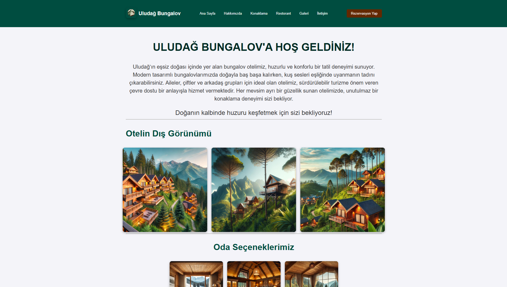
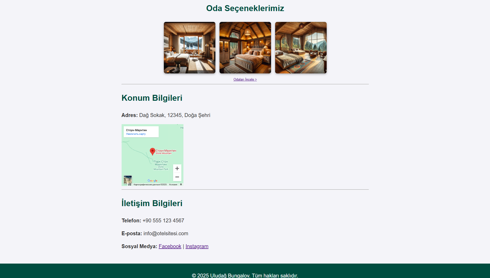

---

### Ana Sayfa Özellikleri:
- **Kullanıcı Dostu Arayüz:** Kullanıcılar otel hakkında bilgilere kolayca erişebilir, görseller üzerinden oda seçeneklerini inceleyebilir.
- **Responsive Tasarım:** Ana sayfa, tüm cihazlarda sorunsuz bir şekilde çalışır.
- **Rezervasyon Yönlendirmesi:** Tek bir tıklamayla rezervasyon sayfasına erişim sağlar.
- **Konum ve İletişim:** Harita entegrasyonu ile otel konumu ve iletişim bilgileri kullanıcıya sunulmuştur.
# Hakkımızda Sayfası

Hakkımızda sayfası, otelimizle ilgili detaylı bilgileri kullanıcılara sunarak, misyonumuzu, sunduğumuz hizmetleri ve tesis özelliklerini tanıtmaktadır.

---

## Sayfa Görünümü

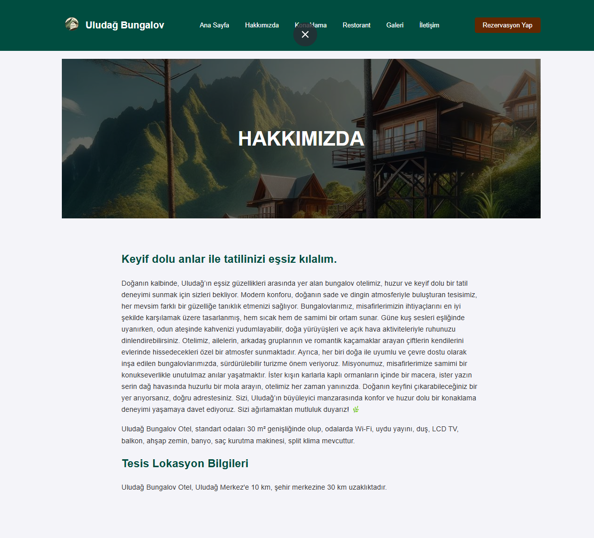

### Sayfa Özellikleri:
- **Bilgilendirici İçerik:** Kullanıcılar, otel hakkında detaylı bilgilere bu sayfa üzerinden kolayca ulaşabilir.
- **Göze Hitap Eden Tasarım:** Görsel ve metin düzeni, kullanıcı deneyimini artırmak üzere tasarlanmıştır.
- **Uyumlu Yapı:** Tüm cihazlarda optimize edilmiş, responsive bir tasarıma sahiptir.

### Açıklama:
Hakkımızda sayfasında, otelin misyonu ve sunduğu hizmetler net bir şekilde açıklanmaktadır. Kullanıcılar, otelin çevresel konum avantajlarını ve misafirperverlik anlayışını burada öğrenebilir.

---

Bu sayfa, otelin profesyonel yaklaşımını ve müşteri memnuniyetine verdiği önemi vurgulayan bir yapıdadır.
# Konaklama Sayfası

Konaklama sayfası, otelin sunduğu oda seçeneklerini detaylı ve görsel bir şekilde kullanıcıya tanıtan bir bölümdür. Bu sayfa, kullanıcıların farklı oda tiplerini karşılaştırmasına ve tercihlerine göre rezervasyon yapmasına olanak tanır.

---

## Sayfa Görünümü

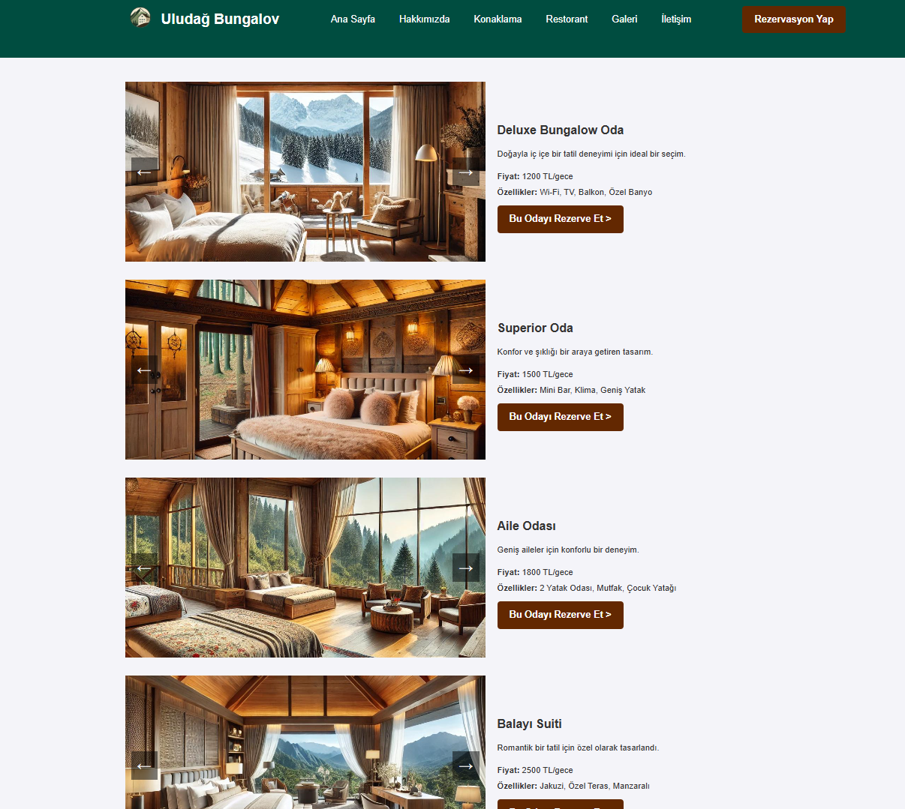

### Sayfa Özellikleri:
- **Oda Seçenekleri:** Kullanıcıların ihtiyaçlarına uygun şekilde düzenlenmiş farklı oda türleri (Deluxe Oda, Superior Oda, Aile Odası, Balayı Süiti) detaylı bilgilerle sunulmuştur.
- **Fiyat Bilgileri:** Her oda tipi için güncel fiyat bilgisi yer almaktadır.
- **Rezervasyon Kolaylığı:** Her oda tipi için doğrudan rezervasyon yapmayı sağlayan butonlar eklenmiştir.
- **Kullanıcı Dostu Düzen:** Görseller ve bilgiler, kullanıcıların hızlı karar vermesine yardımcı olacak şekilde düzenlenmiştir.

### Açıklama:
Bu sayfa, kullanıcıların otel odalarını özelliklerine göre karşılaştırmasını ve seçimini kolayca yapmasını sağlar. Sayfa, otel deneyimini modern ve etkili bir tasarımla dijital ortama taşımaktadır.

---

Projenin bu bölümü, otel rezervasyon sürecini basitleştirmek ve kullanıcı deneyimini geliştirmek amacıyla tasarlanmıştır.
# Restorant Sayfası

Restorant sayfası, otelin restoran hizmetlerini ve sunulan menüleri tanıtmak amacıyla oluşturulmuştur. Doğa ile iç içe bir ortamda lezzetli yemeklerin tadını çıkarabileceğiniz bir deneyimi yansıtmaktadır.

---

## Sayfa Görünümü

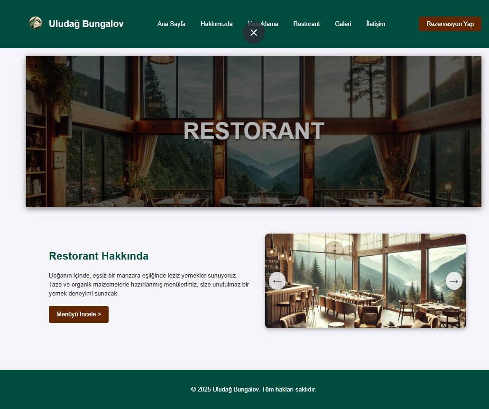

### Sayfa Özellikleri:
- **Göze Hitap Eden Tasarım:** Restoranın ferah ve doğal manzarasını vurgulayan bir başlık bölümü.
- **Kısa Bilgilendirme:** Kullanıcılara restoranın özellikleri ve menüler hakkında genel bir fikir sunar.
- **Menü İncele Butonu:** Kullanıcılar, detaylı menü bilgilerine erişim sağlayan buton ile yönlendirilir.

### Açıklama:
Bu sayfa, otelin restoranının doğal manzarası ve yemek çeşitliliğini ön plana çıkaran bir düzenle hazırlanmıştır. Taze ve organik malzemelerle hazırlanmış yemeklerin sunulduğu bir ortamı tanıtır.

---

Restorant sayfası, kullanıcıların otel restoranı hakkında hızlı bilgi edinmesini ve menülere kolayca ulaşmasını sağlayan bir yapıya sahiptir.
# Otel Galerisi Sayfası

Galeri sayfası, otelin hem iç hem de dış mekanlarına dair görsellerin kullanıcıya sunulduğu bir bölümdür. Bu sayfa, otelin atmosferini görsellerle yansıtarak kullanıcıların otel hakkında daha fazla bilgi edinmesine olanak sağlar.

---

## Sayfa Görünümü

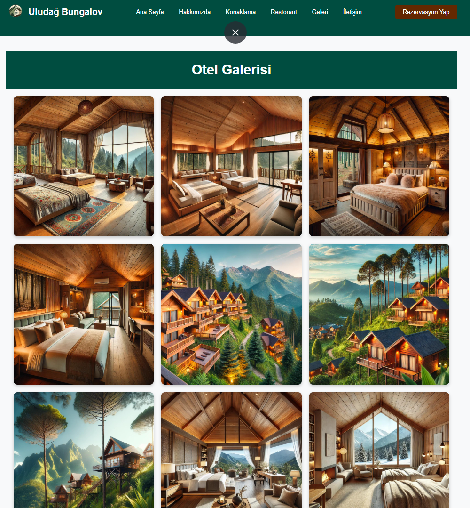

### Sayfa Özellikleri:
- **Görsel Düzenleme:** Otelin odalarını, dış mekanlarını ve diğer alanlarını gösteren fotoğraflar, kullanıcıların otel atmosferini görsel olarak deneyimlemelerine yardımcı olur.
- **Düzenli Yapı:** Görseller, modern ve temiz bir grid düzeniyle yerleştirilmiştir.
- **Detaylı Sunum:** Kullanıcıların otel hakkında daha fazla bilgi edinmesini sağlayan geniş kapsamlı bir galeri.

### Açıklama:
Bu sayfa, otelin sunabileceği tüm özellikleri görsellerle etkileyici bir şekilde sergiler. Otel galerisi, kullanıcıların otel konforu ve tasarımı hakkında görsel bilgi edinmesini sağlar.

---

Galeri sayfası, otelin hem konaklama hem de genel atmosferini yansıtarak, otelin çekiciliğini ve kalitesini tanıtan önemli bir bölümdür.
# İletişim Sayfası

İletişim sayfası, kullanıcıların otel yönetimiyle kolayca iletişim kurmasını sağlayan bir bölümdür. Bu sayfa, hem doğrudan iletişim bilgilerini hem de mesaj gönderme formunu içermektedir.

---

## Sayfa Görünümü

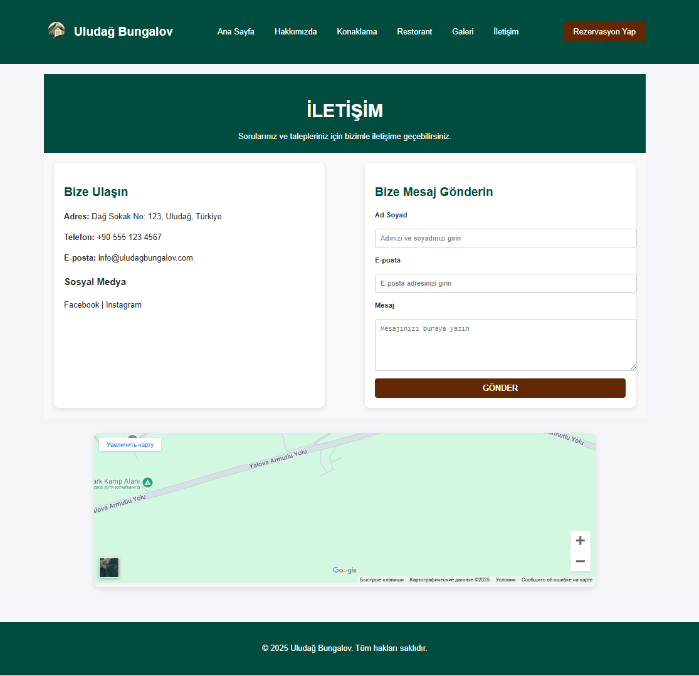

### Sayfa Özellikleri:
- **Bize Ulaşın Bölümü:** Otelin adresi, telefon numarası, e-posta bilgileri ve sosyal medya hesapları kullanıcılarla paylaşılmıştır.
- **Mesaj Gönderme Formu:** Kullanıcılar, ad soyad, e-posta ve mesaj bilgilerini girerek doğrudan otel yönetimine ulaşabilir.
- **Harita Entegrasyonu:** Google Maps entegrasyonu sayesinde otelin konumu kullanıcılarla paylaşılmıştır.
- **Kullanıcı Dostu Arayüz:** Sayfa, kullanıcıların ihtiyaç duydukları bilgilere hızlı ve kolay erişimini sağlamak üzere tasarlanmıştır.

### Açıklama:
Bu sayfa, kullanıcıların sorularını, önerilerini ve taleplerini kolayca iletmelerini sağlayarak otel ile kullanıcı arasındaki iletişimi güçlendirmeyi amaçlar.

---

İletişim sayfası, otelin profesyonelliğini ve müşteri memnuniyetine verdiği önemi sergileyen önemli bir bileşendir.
# Rezervasyon Sayfası

Rezervasyon sayfası, kullanıcıların otel odaları için hızlı ve kolay bir şekilde rezervasyon yapmalarını sağlayan bir form içerir. Bu sayfa, kullanıcı dostu ve işlevsel bir tasarıma sahiptir.

---

## Sayfa Görünümü

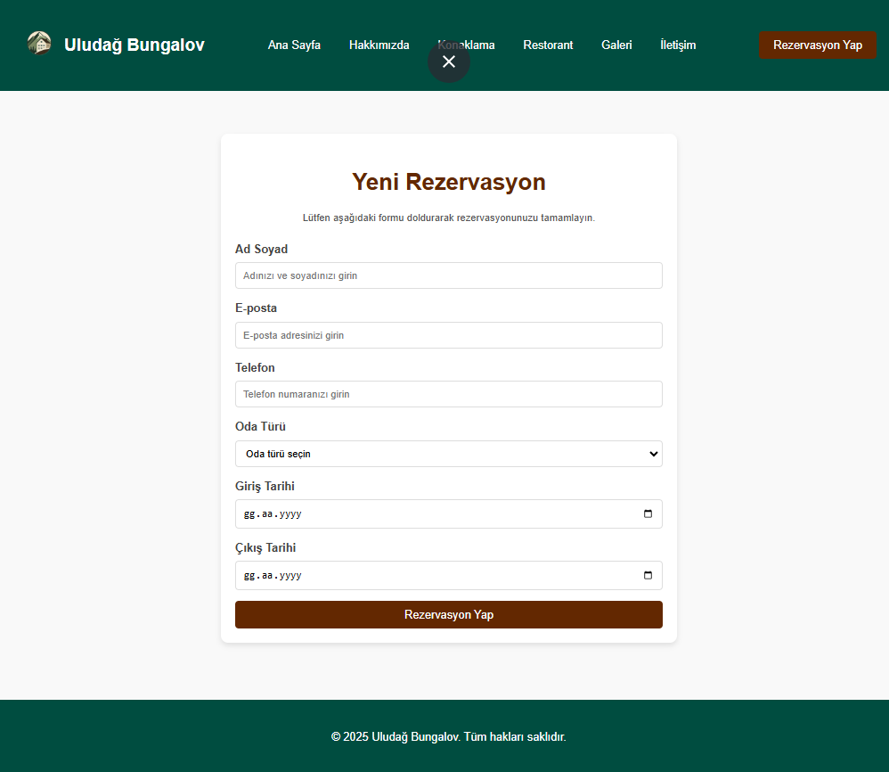

### Sayfa Özellikleri:
- **Rezervasyon Formu:** Kullanıcılar, ad soyad, e-posta, telefon, oda türü, giriş ve çıkış tarihlerini girerek rezervasyon işlemini tamamlayabilir.
- **Dinamik Oda Türleri:** Kullanıcılar mevcut oda türlerinden kolayca seçim yapabilir.
- **Tarih Seçimi:** Giriş ve çıkış tarihleri için kolayca seçilebilen bir tarih seçici (date picker) bulunmaktadır.
- **Kullanıcı Dostu Tasarım:** Form, kullanıcıların hızlı ve hatasız bir şekilde rezervasyon yapmasına olanak tanır.

### Açıklama:
Rezervasyon sayfası, otel müşterilerinin ihtiyaçlarını karşılayacak şekilde optimize edilmiştir. Tüm rezervasyon süreci basit ve kolay bir kullanıcı deneyimi sunar.

---

Bu sayfa, otel rezervasyon süreçlerini dijitalleştirerek kullanıcıların her an her yerden rezervasyon yapabilmelerine olanak sağlar.
# Yönetici Paneli Sayfaları

Yönetici paneli, otel yönetiminin sistem üzerinde oturum açmasını ve kayıt işlemlerini gerçekleştirmesini sağlayan özel bir bölümdür. Yönetici giriş ve kayıt ekranları, basit ve kullanıcı dostu bir arayüzle tasarlanmıştır.

---

## Yönetici Giriş Ekranı

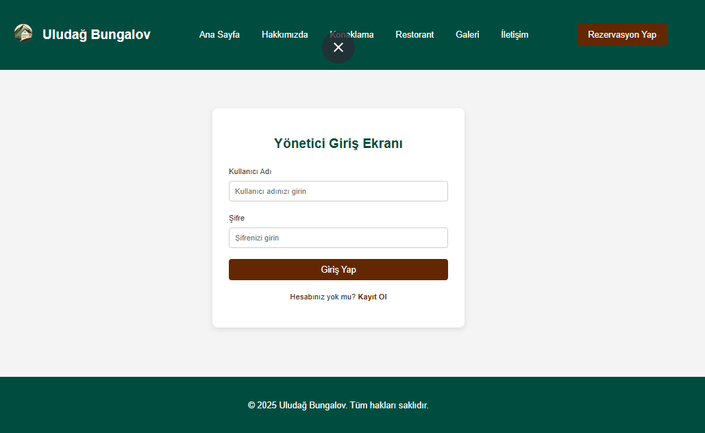

### Sayfa Özellikleri:
- **Kullanıcı Adı ve Şifre:** Giriş yapmak için kullanıcı adı ve şifre bilgileri gereklidir.
- **Giriş İşlemi:** Yönetici, bilgilerini doğru şekilde girdikten sonra "Giriş Yap" butonuyla sisteme erişebilir.
- **Hesap Oluşturma Yönlendirmesi:** Giriş ekranından yeni bir hesap oluşturmak isteyen kullanıcılar, "Kayıt Ol" bağlantısıyla kayıt ekranına yönlendirilebilir.

---

## Yönetici Kayıt Ekranı

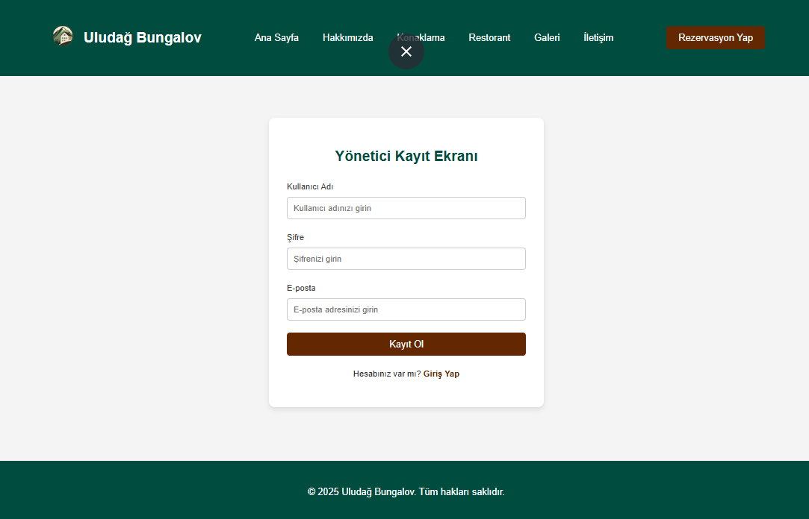

### Sayfa Özellikleri:
- **Bilgi Girişi:** Yeni yönetici hesabı oluşturmak için kullanıcı adı, şifre ve e-posta bilgileri gereklidir.
- **Kayıt İşlemi:** Kullanıcı bilgileri tamamlandıktan sonra "Kayıt Ol" butonuyla yeni bir hesap oluşturulabilir.
- **Girişe Yönlendirme:** Zaten bir hesabı olan kullanıcılar, "Giriş Yap" bağlantısıyla giriş ekranına yönlendirilebilir.

---

### Açıklama:
Yönetici paneli sayfaları, otel yönetim sistemine erişimi düzenlemek için tasarlanmıştır. Yönetici giriş ve kayıt işlemleri güvenli ve kolay bir şekilde gerçekleştirilir.

Bu sayfalar, otel yönetim sürecini dijitalleştirerek modern bir yönetim deneyimi sunmayı amaçlar.
# Yönetici Paneli

Yönetici paneli, otel yönetiminin sistem üzerinde mesajları, rezervasyonları ve hesap bilgilerini kolayca yönetmesini sağlayan bir kontrol merkezi sunar. Panel, modern ve kullanıcı dostu bir arayüzle tasarlanmıştır.

---

## Ana Sayfa (Dashboard)

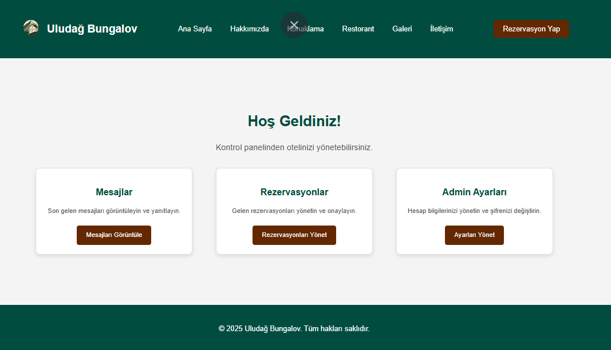

### Özellikler:
- **Mesajlar:** Kullanıcı mesajlarını görüntüleme ve yanıtlama.
- **Rezervasyonlar:** Gelen rezervasyonları yönetme ve onaylama.
- **Admin Ayarları:** Hesap bilgilerini güncelleme.

Bu ekran, yöneticinin hızlı bir şekilde ihtiyaç duyduğu işlemleri gerçekleştirmesine olanak tanır.

---

## Gelen Mesajlar

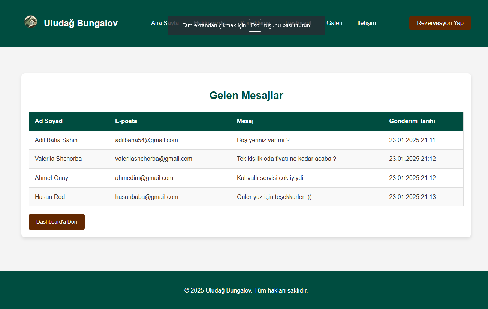

### Özellikler:
- **Mesaj Listesi:** Kullanıcılardan gelen tüm mesajları ad, e-posta ve tarih bilgisiyle görüntüleyin.
- **Hızlı Geri Dönüş:** Mesajlara hızlı bir şekilde erişerek yanıt verme olanağı.

Mesajlar ekranı, kullanıcı geri bildirimlerini etkili bir şekilde yönetmek için optimize edilmiştir.

---

## Gelen Rezervasyonlar

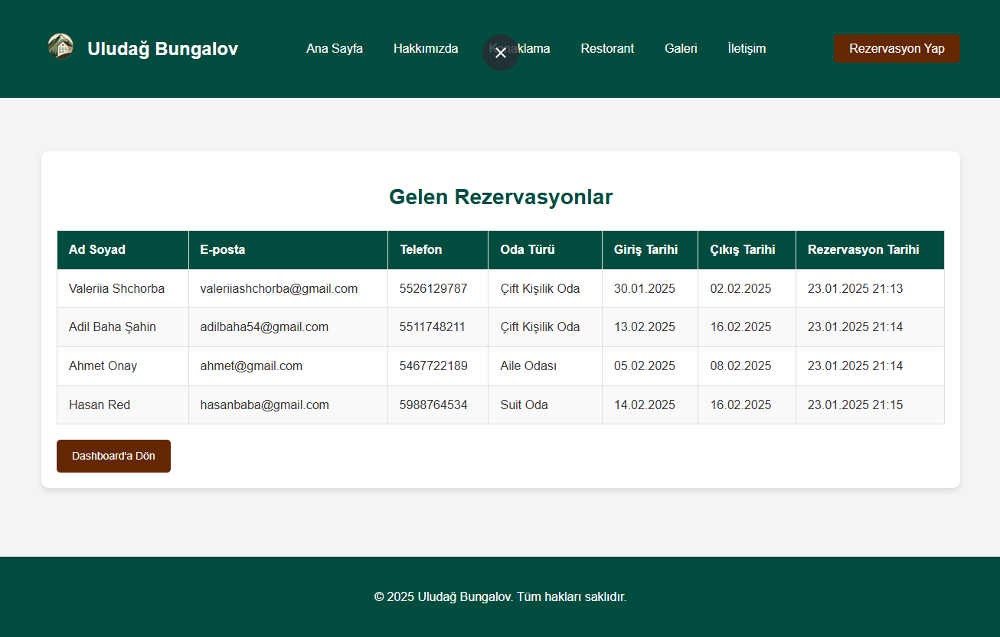

### Özellikler:
- **Rezervasyon Detayları:** Ad, e-posta, telefon, oda türü, giriş-çıkış tarihleri ve rezervasyon tarihi gibi bilgileri içerir.
- **Yönetim Kolaylığı:** Gelen tüm rezervasyonlar düzenli bir tablo halinde sunulur.

Rezervasyonlar ekranı, yöneticinin tüm rezervasyonları kolayca takip etmesini ve yönetmesini sağlar.

---

## Admin Ayarları

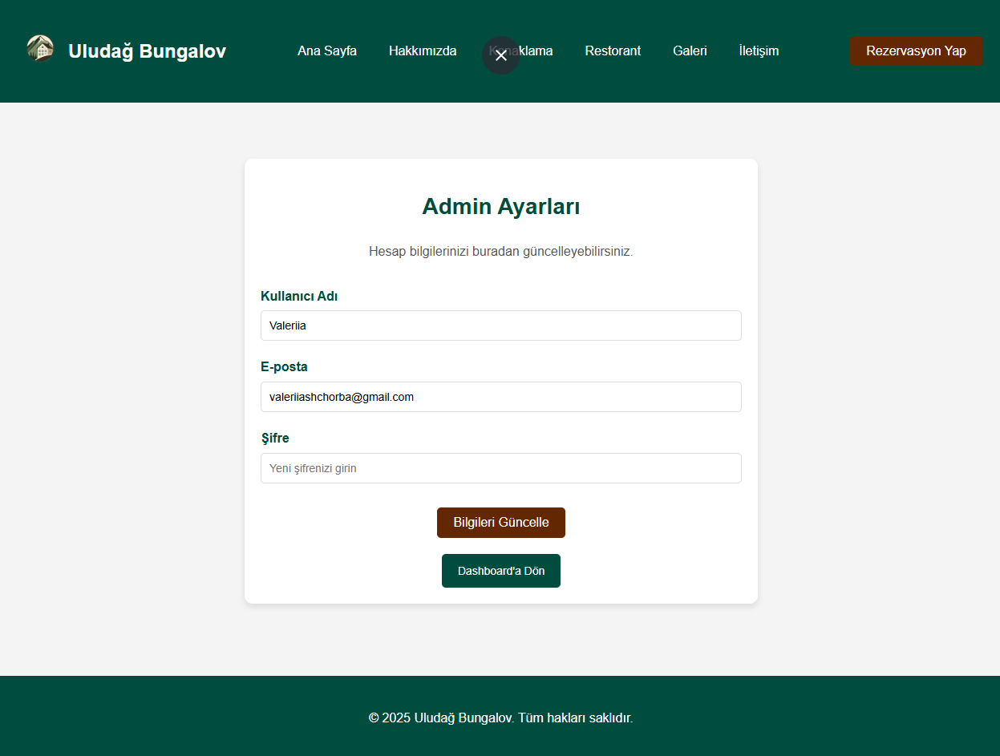

### Özellikler:
- **Hesap Güncelleme:** Kullanıcı adı, e-posta ve şifre bilgilerini düzenleme.
- **Güvenli Yönetim:** Hesap bilgilerini güncel tutmak için kullanıcı dostu bir arayüz.

Admin ayarları ekranı, yönetici hesaplarının güvenliğini ve bilgilerin güncelliğini sağlamak için geliştirilmiştir.

